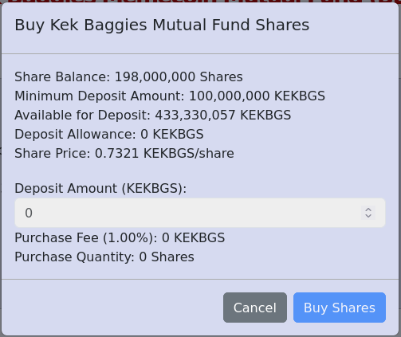

# Kek Baggies Memecoin Mutual Fund

The Kek Baggies Memecoin Mutual Fund is a smart contract operating as a pooled investment fund for a basket of memecoins and other tokens on the Base chain.
Our goal is to seek returns by providing exposure to the memecoin market while reducing overall risk through diversification.
The fund provides to investors a convenient way to invest in memecoins without having to put in the effort of manually managing their own crypto portfolio.

The mutual fund is deployed entirely on-chain, enabling us to operate with much greater transparency and decentralization than investors would be
able to experience with a traditional mutual fund.

This README is intended to serve as a complete documentation of the mutual fund contract and the web interface for interacting with it. This is
a living document which will be updated for completeness and clarification as necessary.

If you have any questions or concerns, please join us on [Telegram](https://t.me/KekBaggiesToken).

## Contents
* [Quickstart](#quickstart)
    * [Buying Shares](#buying-shares)
    * [Selling Shares](#selling-shares)
* [Mutual Fund Structure](#mutual-fund-structure)
    * [Contract](#contract)
    * [Contract Constructor Arguments](#contract-constructor-arguments)
    * [Portfolio Management](#portfolio-management)
    * [Shares](#shares)
    * [Minimum Deposit](#minimum-deposit)
    * [Disabling Deposits](#disabling-deposits)
    * [Fees](#fees)
    * [Slippage](#slippage)
* [Reserve Token](#reserve-token)
* [Contract Addresses](#contract-addresses)
* [Disclaimer](#disclaimer)

## Quickstart
If you are not interested in reading about all of the details of the internal workings of the fund, this section provides
a quick guide on how to use the web interface to buy and sell shares.

1. Install the MetaMask browser extension and use it to create a new Web3 wallet.
2. Buy some ETH on the Base chain, or bridge ETH from another chain to Base.
3. Use your Base ETH to buy our reserve token [$KEKBGS on Uniswap](https://app.uniswap.org/swap?outputCurrency=0xe7A704EAA3232756C8504FCF01Dcb535dc2df2A2&chain=base).
4. **(Optional)** Add $KEKBGS to your MetaMask wallet by importing the contract address `0xe7A704EAA3232756C8504FCF01Dcb535dc2df2A2`.
5. Visit https://kekbaggi.es/fund/ to access the fund's web interface.
6. The website will prompt you to connect to the Base chain if you do not currently have it selected in your wallet. Click the `Switch to Base Chain` button and allow the Base chain to be added to your list of networks if necessary. Then allow your active chain to be switched to Base. Upon switching your selected chain, the page will refresh.
7. The website will then prompt you to connect a wallet. Click the `Connect Wallet` button and select the account that has your $KEKBGS tokens. The page will refresh again upon selecting a new account.

### Buying Shares
Now that you have $KEKBGS on Base and have connected your wallet to the fund's web interface, you can buy shares of the Kek Baggies Memecoin Mutual Fund.

1. In the `Manage Account` section of the web interface, click the `Buy Shares` button.
2. In the modal that appears, you can view your current share balance as well as the amount of $KEKBGS available for buying shares in your wallet.
3. Enter a deposit amount of $KEKBGS in the input field. We will subtract the deposit fee and then divide the
remainder by the current share price to determine how many shares to buy. The final purchase quantity is displayed in the modal. You must deposit at least the amount of KEKBGS shown in
the `Minimum Deposit Amount` field.
5. Click `Approve Tokens` and then confirm the transaction in your wallet. Approving the tokens will allow the fund contract to spend your tokens on portfolio assets on your behalf.
6. Wait a few moments for the approval transaction to be confirmed.
7. Once your token allowace is updated, the `Approve Tokens` button will change to say `Buy Shares`.
8. Click `Buy Shares` and then confirm the transaction in your wallet.
9. Wait a few moments for the share purchase transaction to be confirmed.
10. Once the purchase transaction is confirmed, the page will refresh. Don't panic if the page doesn't update to show your new share balance right away.
Due to latency in the Base RPC provider, you may need to refresh the page a few times before your new share balance and equity are shown correctly.
11. You are now a shareholder in the Kek Baggies Memecoin Mutual Fund!
12. **(Optional)** Add the share token $KBMFST to your MetaMask wallet by importing the contract address `0xa34A1adDE2dDDfB1FB54024285daB566E755e188`.
This will enable you to view your share balance directly in your wallet or transfer the share tokens to another account.

**SHARES CAN ONLY BE BOUGHT FROM THE FUND BY USING THE WEB INTERFACE.**

**DO NOT SEND $KEKBGS OR OTHER ASSETS DIRECTLY TO THE FUND'S CONTRACT ADDRESS. NO SHARES WILL BE ISSUED TO YOU IF YOU DO THIS.**

**ONLY USE THE SHARE PURCHASE PROCEDURE OUTLINED IN THIS DOCUMENT. WE WILL NOT BE ABLE TO HELP YOU RECOVER YOUR ASSETS IF YOU JUST SEND THEM TO THE FUND'S CONTRACT ADDRESS.**

### Selling Shares

Now that you are holding share tokens, you can sell your shares back to the fund at the current share price at any time.

1. In the `Manage Account` section of the web interface, click the `Sell Shares` button.
2. In the modal that appears, you can view your current share balance as well as the current share price.
3. Enter the amount of shares you wish to sell in the `Sell Quantity` field.
4. Paste the Base wallet address to which you wish to send proceeds from the share sale in the `To Address` field.
5. The `Estimated Proceeds` display will update to show an estimate of the total amount of $KEKBGS tokens you will receive in exchange for your shares. Due to slippage during asset liquidation, the actual $KEKBGS tokens you receive may be slightly less than the displayed estimate.
6. **Double check to verify that you have entered the correct address. We cannot help you recover funds if you send them to the wrong address.**
7. Click `Sell Shares` and confirm the transaction in your wallet.
8. Once the transaction is confirmed, the page will refresh. Don't panic if the page doesn't update to show your new share balance right away.
Due to latency in the Base RPC provider, you may need to refresh the page a few times before your new share balance and equity are shown correctly.

**SHARES CAN ONLY BE SOLD TO THE FUND BY USING THE WEB INTERFACE.**

**DO NOT SEND SHARE TOKENS DIRECTLY TO THE FUND'S CONTRACT ADDRESS. YOUR SHARES WILL BE LOST IF YOU DO THIS.**

**ONLY USE THE SHARE SALE PROCEDURE OUTLINED IN THIS DOCUMENT. WE WILL NOT BE ABLE TO HELP YOU RECOVER YOUR SHARES IF YOU JUST SEND THEM TO THE FUND'S CONTRACT ADDRESS.**
## Mutual Fund Structure
The fund is structured similarly to a traditional open-ended mutual fund where shares are able to be purchased from and sold back to the fund at the current share price at any time.
Investors can use our reserve token $KEKBGS to purchase shares directly from the fund.
See the [Shares](#shares) subsection for more information.

### Contract
The source code of the mutual fund contract is available in this repository and is verified on [BaseScan](https://basescan.org/address/0x91183c921f3e56e3e793dd8a5a3ee8250c3cc9d7#code).

The contract is responsible for maintaining custody over user deposits, as well as the buying/selling of portfolio assets with funds deposited by users. The contract has full
custody over these assets and manages them as specified in the contract code. Devs are not able to sell or transfer portfolio assets out of the fund. Investors are always
entitled to receive the full value (less slippage) of their asset entitlement by selling their shares back to the fund at the current share price.

When a user deposits KEKBGS into the fund by calling `deposit(uint256 amount)`, the fund contract transfers `amount` KEKBGS from the user's wallet to the fund's contract address.
The contract then calculates the total number of purchased shares by dividing the deposited amount of KEKBGS by the current share price. The contract only sells whole shares,
so we only transfer the total value of the whole number of shares purchased minus their "change".
The contract then uses the deposited KEKBGS to purchase portfolio assets according to the specified asset allocation.
Finally, the fund contract mints to the user's wallet the previously-calculated quantity of share tokens.

When a user sells shares back to the fund by calling `withdraw(uint256 shares, address to)`, the fund sells portions of the fund's portfolio assets for KEKBGS and transfers
the proceeds to the address specified by `to`. The calling account must have at least the number of share tokens specified by the `shares` argument. For each token in the
fund's portfolio, the sale quantity is calculated by `shares * token.balanceOf(address(this)) / sharesOutstanding` where `address(this)` is the address of the mutual fund
contract. We then transfer the user's reserve token entitlement to the address specified by `to` by calculating `shares * getReserveTokenBalance() / sharesOutstanding`.
Finally, the contract burns from the user's wallet the number of shares they sold back to the fund.

These buying/selling operations should typically be performed in the web UI as documented above. Only advanced users should interact with the smart contract functions directly.
Please contact us on Telegram if you need help with this.

For this first version of the mutual fund contract, the fund is only able to buy and sell assets that are exchanged on Uniswap V2. Future versions of this mutual fund
may have support for more exchange protocols, but we decided to keep the initial version simple by only supporting one exchange protocol.

There are a few additional read-only contract functions that would be useful to document here:
* `getNetAssetValue()` returns the total value of all assets held by the fund contract in KEKBGS, minus the current deposit fee balance.
* `getReserveTokenBalance()` returns the total quantity of reserve tokens currently held by the fund minus the current deposit fee balance.
* `getPortfolio()` returns information about the fund's asset holdings, including contract addresses, portfolio allocation basis points, token symbols,
token balances, and token balance value in KEKBGS for each asset in the fund's portfolio.

There are also a number of additional self-explanatory getters and setters that can be inspected by reading the contract source code. Please contact us on Telegram
if you need help understanding any part of the source code.

### Contract Constructor Arguments
If you wish to deploy your own instance of the fund contract using the provided source code, the following constructor arguments must be supplied:

* `address _reserveTokenAddress` - The contract address of the reserve token for the fund. See the [Reserve Token](#reserve-token) section.
* `string memory _shareTokenName` - The verbose name to assign to the share token contract that will be deployed by the fund contract
* `string memory _shareTokenSymbol` - The symbol to assign to the share token contract that will be deployed by the fund contract
* `address _uniswapV2Router02Address` - The address of the UniswapV2Router02 contract deployment on the chain you're deploying on. For Base, this is `0x4752ba5DBc23f44D87826276BF6Fd6b1C372aD24`.
* `uint256 _deadlineOffset` - The Unix time offset from the current block's timestamp after which Uniswap buy/sell transactions will revert. A reasonable value for this is `300` for a five-minute offset.
The contract owner can update this value after deployment by calling `setDeadlineOffset(uint256 _deadlineOffset)`.
* `bool _depositsEnabled` - Whether deposits should be initially enabled. The contract owner can update this value after deployment by calling `setDepositsEnabled(bool _depositsEnabled)`.
* `uint256 _minimumDeposit` - The minimum deposit amount of reserve tokens. Set this to `0` to disable the minimum deposit requirement. **NOTE**: this value should be specified in
absolute units of the reserve token. For example, if your reserve token has 18 decimals and you want the minimum deposit to be 1000 tokens, you should set this value to
`1000 * 10**18` -> `1000000000000000000000`. The contract owner can update this value after deployment by calling `setMinimumDeposit(uint256 _minimumDeposit)`. See the [Minimum Deposit](#minimum-deposit) section.
* `uint256 _slippageTolerance` - The slippage tolerance for Uniswap transactions in basis points. For example, to set a slippage tolerance of 1%, set this field to `100`.
The contract owner can update this value after deployment by calling `setSlippageTolerance(uint256 _slippageTolerance)`. See the [Slippage](#slippage) section.
* `uint256 _depositFee` - The fee to charge for each reserve token deposit in basis points. For example, to set a 1% deposit fee, set this field to `100`. The contract owner
can update this value after deployment by calling `setDepositFee(uint256 _depositFee)`, but the deposit fee cannot be set higher than it was set to on contract creation.
See the [Fees](#fees) section.

### Portfolio Management
The owner of the contract is able to set the portfolio allocation by calling `setAllocation(address tokenAddress, uint256 _allocation)` on the contract. `tokenAddress` is the
address of the token to be added/updated in the portfolio, and `_allocation` is the portfolio allocation to set for the token in basis points. The maximum total allocation
of all assets in the fund is 10,000 basis points (100%).

`_allocation` cannot be the same as the asset's current allocation. If `_allocation` is greater than the current allocation, then an amount of reserve tokens proportional
to the change in allocation will be used to purchase the asset on Uniswap. If `_allocation` is less than the current allocation, then an amount of the asset proportional to the
change in the allocation will be sold on Uniswap for reserve tokens.

In addition to buying/selling assets upon setting the allocation, the allocation percentage also determines how user deposits are allocated when the user buys shares.
The unallocated percentage will remain held in the fund's reserve token. So if the total asset allocation is 6,000 basis points (60%), 40% of deposits will be held
in the reserve token.

### Shares
Users are able to buy shares from and sell shares to the mutual fund contract at the current share price. The share price is calculated as `getNetAssetValue() / getSharesOutstanding()` where `NetAssetValue`
is the total value of the fund's assets in KEKBGS minus the current deposit fee balance. `SharesOutstanding` is the total count of shares that are currently held by investors.

Shares in the fund are issued as standard ERC20 tokens. When a user buys shares, the fund contract mints to their wallet a quantity of share tokens equal to the number of shares they bought.
When a user sells shares back to the fund, the fund contract burns from their wallet a quantity of share tokens equal to the number of shares they sold. Since any purchase/sale of shares
causes `NetAssetValue` and `SharesOutstanding` to increase by equivalent values (in terms of KEKBGS), purchases/sales of shares do not directly affect the current share price. In practice,
the share price may be slightly affected due to slippage in the purchase/sale of assets when shares are bought/sold, but this price impact will not be significant.

The share token contract is deployed and owned by the mutual fund contract. Devs have no direct control over how share tokens are minted/burned; all of this behavior is specified in
the mutual fund contract code.

Issuing mutual fund shares as ERC20 tokens enables these share tokens to be freely transferred and exchanged between accounts. The share tokens could even be listed on decentralized exchanges.
The mutual fund contract is not concerned with the original purchaser of share tokens; any bearer of the fund's share tokens is able to sell them back to the fund at the current share price. This offers
much greater flexibility than a traditional mutual fund where investors typically do not have direct custody over their shares in the fund.

There is no limit to the number of shares that users can buy/sell from/to the mutual fund contract. Users are able to transact shares with the fund contract at the current share
price at any time. This share structure is similar to that of a traditional open-ended mutual fund.

### Minimum Deposit
The owner of the contract is able to set a minimum deposit amount of KEKBGS by calling `setMinimumDeposit(uint256 _minimumDeposit)`. A minimum deposit amount is necessary because
the swaps will fail on Uniswap if the user deposits too few KEKBGS to be allocated appropriately to all of the portfolio assets, but the depositor will still have to pay
gas fees for the failed transaction.

The minimum deposit amount is adjustable at any time and can be set to 0 to disable the minimum deposit functionality. It is currently set to 100,000,000 KEKBGS on the live fund contract.

### Disabling Deposits
Deposits are able to be disabled by the owner of the contract by calling `setDepositsEnabled(false)`. In this case, no new shares will be able to be purchased from the fund. Investors
will still be able to sell their current shares back to the fund at the current share price.

The contract owner can re-enable deposits by calling `setDepositsEnabled(true)`. The will enable users to buy shares from the fund again.

### Fees
The fund contract charges a percentage deposit fee in $KEKBGS before shares are purchased. The contract owner is able to lower this fee in the future,
but the fee can never be set higher than the value it was set to when the contract was deployed. This restriction grants users the guarantee that
the contract owner will never be able to set the deposit fee to something egregious (like 100%, for example).

The Kek Baggies Memecoin Mutual Fund contract was deployed with a deposit fee of 100 basis points (1%). This means that the highest deposit fee that
the fund contract will ever be able to charge is 1%.

Revenue from the Kek Baggies Memecoin Mutual Fund's deposit fees will primarily be used to grow the Kek Baggies project by covering expenses,
paying for marketing services, etc.

No fee is charged when selling shares back to the fund.

### Slippage
Decentralized exchanges are adversarial in nature. It is important to set a slippage tolerance when trading on exchanges like Uniswap to avoid being targeted by MEV bots and "sandwich attacks".

The owner of the mutual fund contract can set a slippage tolerance in basis points by calling `setSlippageTolerance(uint256 _slippageTolerance)`. 100 basis points (1%) is a good tolerance to start
with. If the slippage tolerance is set too low, transactions will fail due to slippage. If the slippage is set too high, transactions will be more susceptible to frontrunning.

## Reserve Token
The reserve token for the Kek Baggies Memecoin Mutual Fund on Base is $KEKBGS (CA `0xe7A704EAA3232756C8504FCF01Dcb535dc2df2A2`).

When the mutual fund contract is deployed, a reserve token contract address must be specified. This is the token which will be used to purchase shares, and the token in terms of which the fund's
net asset value will be quoted. This token is used to purchase assets according to the fund's portfolio allocation. The unallocated percentage remains held in the fund's reserve token.

Shares of the fund will have a somewhat inverse correlation with the price of the reserve token. The strength of this inverse correlation depends on the fund's reserve ratio. If most of the fund's
portfolio is unallocated, then price swings in the reserve token will have a smaller effect on the fund's share price. If most of the fund's portfolio is allocated to other tokens, then price
swings in the reserve token will have a greater effect on the fund's share price. This is because an increase in the reserve token price makes it more expensive to buy back reserve tokens
when the fund's assets are sold, so the share price decreases in this case. Conversely, a decrease in the reserve token price will make it cheaper to buy back reserve tokens when selling the fund's assets,
so the share price will increase.

This inverse correlation between the reserve token price and the fund's share price could create the opportunity for a number of investment strategies. For example, holding the fund's shares could
serve as a hedge against decreases in the price of the reserve token.

## Contract Addresses
* $KEKBGS - `0xe7A704EAA3232756C8504FCF01Dcb535dc2df2A2`
* Kek Baggies Mutual Fund - `0x91183C921f3E56E3e793Dd8A5A3ee8250c3CC9D7`
* Kek Baggies Mutual Fund Share Token - `0xa34A1adDE2dDDfB1FB54024285daB566E755e188`

## Disclaimer
Crypto assets are inherently risky and volatile. While we are attempting to mitigate overall risk by maintaining a diversified portfolio, we offer no promise nor guarantee that investments in the Kek Baggies Memecoin Mutual Fund will return a profit. Do not invest more than you are willing to lose.

The concept of a decentralized mutual fund deployed entirely on-chain is novel. There are no established precedents for how such a mutual fund contract should operate. While we have carefully evaluated the risks of the concept and extensively tested the contract for bugs and security vulnerabilities, we offer no warranty in the event of contract bugs or security breaches.

THE SOFTWARE IS PROVIDED "AS IS", WITHOUT WARRANTY OF ANY KIND, EXPRESS OR IMPLIED, INCLUDING BUT NOT LIMITED TO THE WARRANTIES OF MERCHANTABILITY, FITNESS FOR A PARTICULAR PURPOSE AND NONINFRINGEMENT. IN NO EVENT SHALL THE AUTHORS OR COPYRIGHT HOLDERS BE LIABLE FOR ANY CLAIM, DAMAGES OR OTHER LIABILITY, WHETHER IN AN ACTION OF CONTRACT, TORT OR OTHERWISE, ARISING FROM, OUT OF OR IN CONNECTION WITH THE SOFTWARE OR THE USE OR OTHER DEALINGS IN THE SOFTWARE.
